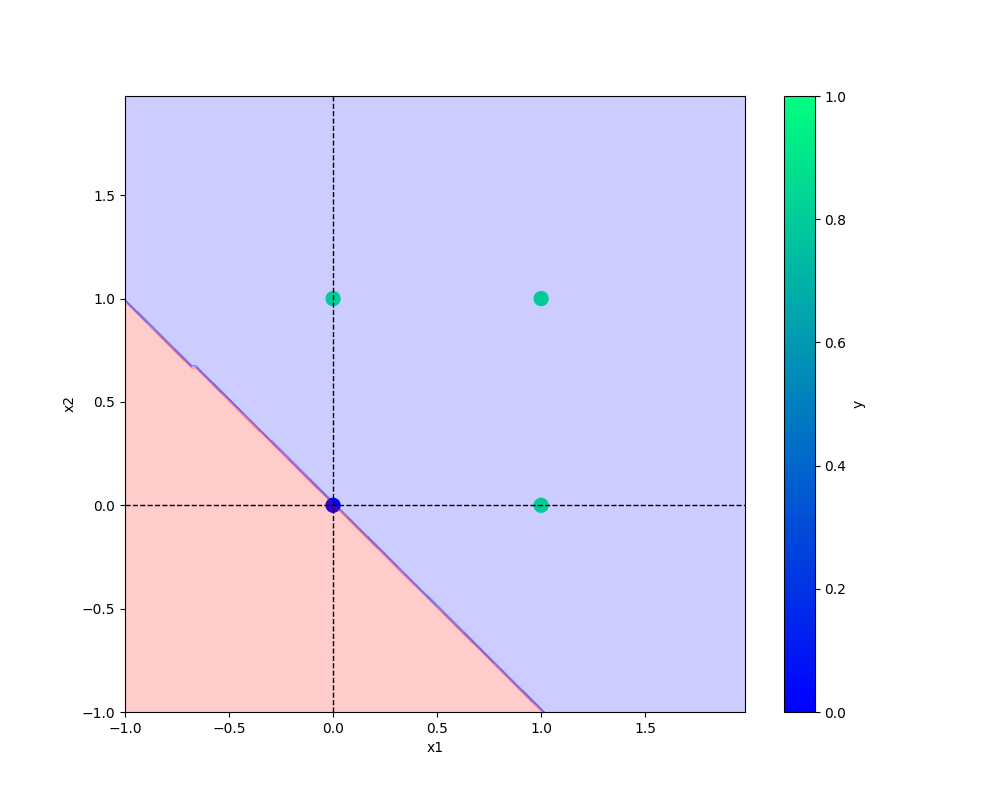

# oneNeuron
oneNeuron !


conda activate oneNeuron

pip install -r requirements.txt

git add .

git commit -m "first commit"

git push origin main

git add . && git commit -m "logging added and progress bar done" && git push origin main


# Add image-


## Python code

```python
def main(data, modelName, plotName, eta, epochs):
    df = pd.DataFrame(data)
    logging.info(f"This is actual dataFrame{df}")

    X, y = prepare_data(df)

    model= Perceptron(eta = eta, epochs= epochs)
    model.fit(X, y)

    _ = model.total_loss() #dummy variable

    save_model(model, filename= modelName)
    save_plot(df, plotName, model)
    ```