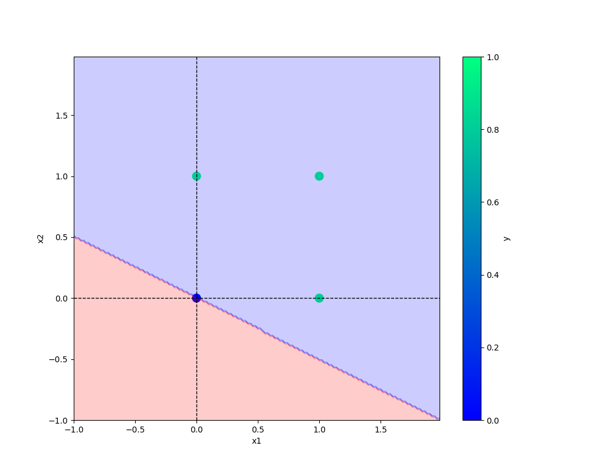

# oneNeuron
oneNeuron !

conda activate oneNeuron

pip install -r requirements.txt

git add .

git commit -m "first commit"

git push origin main

git add . && git commit -m "logging added and progress bar done" && git push origin main

# Add image-
